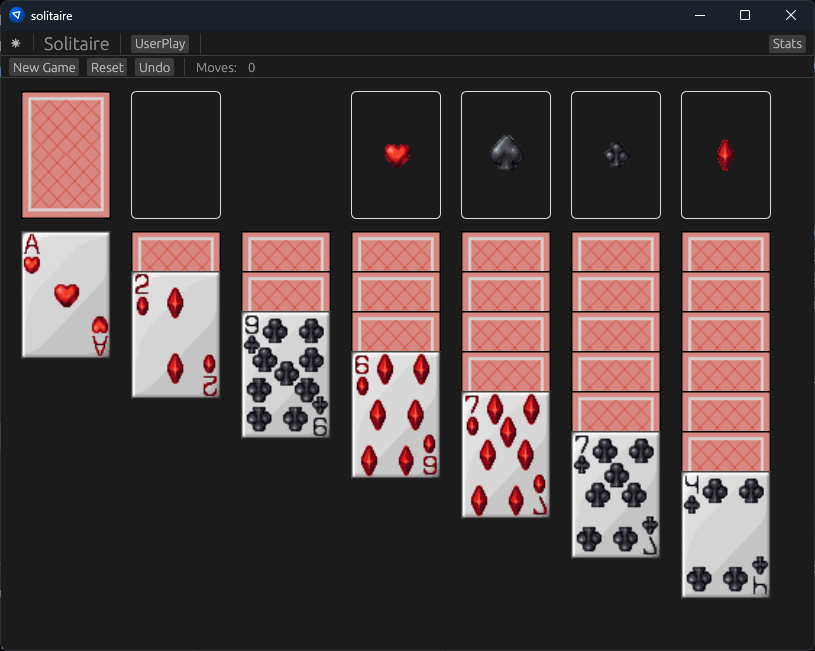

# solitaire-rs

A modular Rust implementation of Solitaire, split into three crates:
* `solitaire-core` – data structures and card logic
* `solitaire-engine` – game state, rules, and randomization
* `solitaire-gui` – an egui‑based desktop/web UI



## Building

```sh
# Build all crates
cargo build

# Build the GUI binary
cargo run -p solitaire-gui
```
